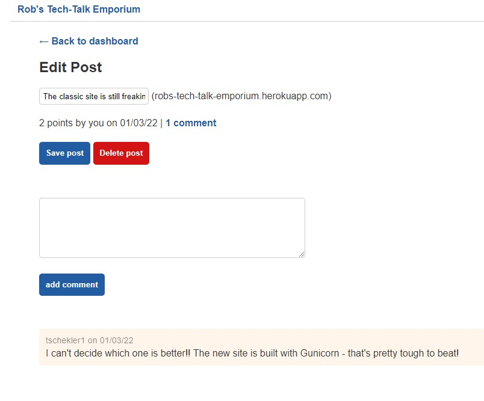
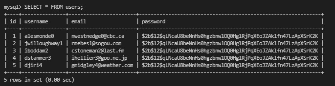
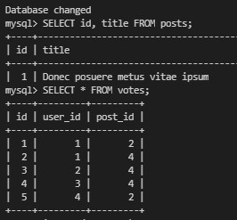

# Python Newsfeed

  
    
  
   
  
   
  
   
  
   
  
  
  ## Description
  
   Use Python as the basis for a web server. 
    
   Instead of building it from scratch, we'll refactor the back end of an app that was originally built using Node.js. 
    
   The app, called Rob's Tech-Talk Emporium, lets users submit links to tech-related articles, comment on other users' articles, and upvote articles for points.
 
  ## Table of Contents
  - [Description](#description)
  - [Documentation](#documentation)
  - [Deployment](#deployment)
  - [Usage](#usage)
  - [Screenshot](#screenshot)
  - [Features](#features)
  - [Acknowledgements](#acknowledgements)
  - [License](#license)
  - [Reflection](#reflection)
  - [Contact](#contact)

  ## Documentation
  
  * Python
      <https://www.python.org/>
  * Flask
      <https://flask.palletsprojects.com/en/2.0.x/>
  * SQLAlchemy
    <https://www.sqlalchemy.org/>
  * Gunicorn
    <https://gunicorn.org/>

  ## Deployment

  This application is deployed using Heroku
    <https://robs-tech-emporium.herokuapp.com/>
 
  ## Usage

  * As a user, I want to be able to view the home and dashboard pages in the browser.
  * As a user, I need a database that can store my account, posts, comments, or upvotes.
  * As a user, I want to be able to see my posts on the homepage.
  * I expect to see dates, URLs, and plural words properly formatted.
  * As a user, I want to be able to log in and have my session remembered if I refresh the page.
  * As a logged-in user, I want to be able to create new posts and comments and upvote other posts.
  * As a user, I want to be able to visit the app on a public URL.

  ### Start the virtual environment (VENV) and Flask server in Powershell: 
  * Activate VENV:
   
   .\venv\Scripts\activate
  * Start server:
   
    python -m flask run
    
  * Deactivate VENV:
   
    deactivate

  ## Screenshot
  
   
  
   
  

  ## Features
  * User authentication
  * User posts
  * User comments
  * User upvotes
  * Edit and delete posts
  * REST API / CRUD operations
  
  # Acknowledgements
  
  * "Python for JavaScript Developers"
    
  © 2020 - 2021 Trilogy Education Services, a 2U, Inc. brand. All Rights Reserved.
    
  ## License
  
   
  Permission to use this application is granted under the MIT license. <https://opensource.org/licenses/MIT>

  ## Reflection
  
  Building this project helped us realize the power and elegance of Python - and that there is still much to learn!
   
  Reflecting on what you recently learned is a proven strategy for making new knowledge stick.
  Spend a few minutes thinking about the following questions:

  * In your own words, describe the key ideas from this module.

  * Give an example of how each key idea is applied.

  * How do these key ideas relate to each other?

  * How do these key ideas relate to what you learned earlier in the course?

  * What are you still curious about?

  ## Contact:
  Holler at me! <a href="mailto:rob.atalla@robatalla816.com">rob.atalla@robatalla816.com</a>