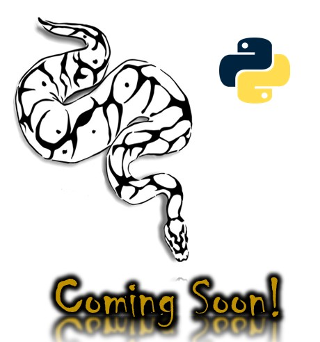

# Python Newsfeed

  
    
  
   
  
   
  
   
  
   
  
  
  ## Description
  
   Use Python as the basis for a web server. Instead of building it from scratch, we'll refactor the back end of an app that was originally built using Node.js. The app, called Just Tech News, lets users submit links to tech-related articles, comment on other users' articles, and upvote articles for points.
 
  ## Table of Contents
  - [Description](#description)
  - [Documentation](#documentation)
  - [Usage](#usage)
  - [Screenshot](#screenshot)
  - [Features](#features)
  - [Acknowledgements](#acknowledgements)
  - [License](#license)
  - [Testing](#testing)
  - [Contact](#contact)

  ## Documentation
  
  * <https://www.python.org/> - Documentation for Python
  * <https://flask.palletsprojects.com/en/2.0.x/> - Flask Documentation
  * Left off here: <https://coding-boot-camp.github.io/continuation-courses/python/lesson-2-models>
 
  ## Usage

  * As a user, I want to be able to view the home and dashboard pages in the browser.
  * As a user, I need a database that can store my account, posts, comments, or upvotes.
  * As a user, I want to be able to see my posts on the homepage.
  * I expect to see dates, URLs, and plural words properly formatted.
  * As a user, I want to be able to log in and have my session remembered if I refresh the page.
  * As a logged-in user, I want to be able to create new posts and comments and upvote other posts.
  * As a user, I want to be able to visit the app on a public URL.

  In Powershell 
  * .\venv\Scripts\activate
  * python -m flask run
  * deactivate

  ## Screenshot
  

  ## Features
  TBD
  
  # Acknowledgements
  
  * Rob Atalla
    
  ## License
  
   
  Permission to use this application is granted under the MIT license. <https://opensource.org/licenses/MIT>

  ## Testing
  TBD

  ## Contact:
  Holler at me! <a href="mailto:rob.atalla@robatalla816.com">rob.atalla@robatalla816.com</a>